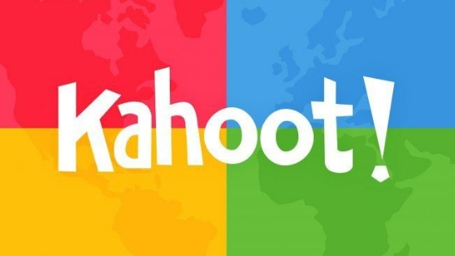
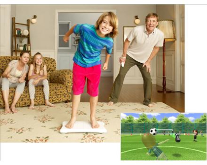

# PEC3: Hibridación del software en la cultura digital contemporánea

**Asignatura:** Cultura Digital 2026

**Autor:** Alba González Fernández 

**Fecha:** 29/04/2026

---

## Introducción 
Desde la publicación de *El lenguaje de los nuevos medios* (2001) y **El software toma el mando** (2013), Lev Manovich analizó cómo el software se convierte en la capa fundamental de la cultura contemporánea. Hoy, más de una década después, esta idea no solo se mantiene, sino que se ha intensificado con la expansión de plataformas digitales, interfaces interactivas y nuevas formas de participación.

En este ensayo se analizan dos casos actuales de hibridación del software: Kahoot y Wii Fit y como en ambos ejemplos se muestran diferentes lógicas culturales (educación, juego, cuerpo, datos) y se combinan en una misma experiencia digital, generando nuevas formas de interacción.

---
## 📚 Caso 1: Kahoot! – Aprender jugando en la cultura del software  

*Imagen 1: Logo de la aplicación Kahoot!*

La plataforma gratuita de gamificación, **representa un claro ejemplo de hibridación** entre educación, videojuego y dinámica social. A primera vista, puede parecer una simple herramienta para crear cuestionarios, pero su diseño revela una integración mucho más compleja de elementos propios de distintos ámbitos.

En primer lugar, Kahoot! incorpora la lógica de la gamificación. Elementos como puntuaciones, rankings en tiempo real, música y presión temporal transforman una actividad tradicionalmente pasiva (responder preguntas) en una experiencia dinámica y competitiva. Este enfoque introduce principios propios del videojuego dentro del contexto educativo.

*Imagen 2: Explicación de cómo crear un nuevo juego para Kahoot!*

En segundo lugar, la plataforma añade una dimensión social. Kahoot! se utiliza normalmente en grupo, ya sea en aulas físicas o en entornos online. Los participantes comparten una experiencia simultánea, generando interacción, emoción colectiva y participación activa. De este modo, el aprendizaje deja de ser individual para convertirse en una experiencia compartida.

Desde la perspectiva de Manovich, Kahoot! puede entenderse como un **sistema basado en la modularidad y la variabilidad**. Cada cuestionario es un módulo que puede ser reutilizado, adaptado o compartido, lo que encaja con la lógica del software contemporáneo. Además, la experiencia del usuario cambia constantemente en función de las respuestas, puntuaciones y ritmo del juego, lo que introduce variabilidad en cada sesión.

Otro aspecto relevante es la automatización. El software gestiona automáticamente el tiempo, corrige respuestas, calcula puntuaciones y genera rankings en tiempo real. Esto reduce la intervención humana y convierte al sistema en un mediador activo del proceso educativo. Esto hace que Kahoot! no sea solo una herramienta educativa, sino una interfaz híbrida donde convergen aprendizaje, entretenimiento y socialización. Este tipo de plataformas ejemplifica cómo el software redefine prácticas culturales tradicionales, transformando la educación en una experiencia interactiva y participativa.

## 🎮 Caso 2: Wii Fit – El cuerpo como interfaz

*Imagen 3: Logo de Wii Fit*

Wii Fit introduce una **forma distinta de hibridación al combinar videojuego, ejercicio físico e interacción corporal**. A diferencia de los videojuegos tradicionales, donde la interacción se realiza mediante mandos, Wii Fit incorpora el cuerpo del usuario como elemento central de la interfaz.

El uso de la Wii Balance Board permite registrar el peso, el equilibrio y los movimientos del usuario, transformando acciones físicas en datos digitales. Este proceso refleja uno de los conceptos clave de Manovich: la transcodificación, es decir, la traducción de fenómenos físicos en información computacional.

Además, Wii Fit introduce la lógica del software en el ámbito del fitness. El ejercicio físico se organiza en forma de rutinas, niveles y objetivos, similares a los de un videojuego. El usuario recibe feedback constante a través de gráficos, puntuaciones y evaluaciones de rendimiento, lo que convierte la actividad física en una experiencia medible y estructurada.

Otro aspecto importante es la hibridación entre entretenimiento y salud. Wii Fit transforma una actividad cotidiana como hacer ejercicio en una experiencia lúdica, accesible y motivadora. Esto amplía el público potencial, incluyendo personas que normalmente no se sentirían atraídas por el deporte tradicional.

Desde la perspectiva de la variabilidad, cada usuario tiene una experiencia distinta en función de su cuerpo, progreso y uso del sistema. El software adapta la experiencia a los datos recogidos, generando una interacción personalizada.

Por lo que, Wii Fit también puede entenderse como un paso hacia nuevas formas de interfaz, donde el cuerpo sustituye a dispositivos tradicionales. Esta idea anticipa tendencias actuales como los sensores biométricos o las interfaces inmersivas.

En conclusión, Wii Fit ejemplifica una hibridación entre cuerpo, software y cultura del entretenimiento. No se trata solo de un videojuego, sino de un sistema que redefine la relación entre tecnología y actividad física.

---
 ## Conclusión  
Ambos casos muestran cómo el **software actúa como un punto de convergencia entre diferentes ámbitos culturales**. Kahoot! transforma la educación en una experiencia lúdica y social, mientras que Wii Fit convierte el ejercicio físico en una actividad digital e interactiva.

Siguiendo las ideas de Manovich, podemos afirmar que la cultura contemporánea no se define por medios aislados, sino por sistemas híbridos donde el software integra múltiples funciones. Estas plataformas no solo combinan tecnologías, sino que también redefinen prácticas sociales, educativas y corporales.

---
## Declaración uso de la IA
Para la elaboración de esta tercera PEC 3, se recurrió puntualmente a herramientas de inteligencia artificial con el propósito de la revisión de estructura y sintáxis. Las intervenciones mediante ChatGPT se han llevado a cabo respetando las directrices establecidas en la asignatura.

## Referencias y bibliografía 

- Manovich, Lev. *El software toma el mando*. Barcelona: Editorial UOC.  
- Adell, R. “Remediación, multimedia e hibridación de los medios”. multimedia.uoc.edu. [Enlace](https://multimedia.uoc.edu/blogs/fem/es/remediacio-multimedia-i-hibridacio-dels-mitjans/?utm_source=chatgpt.com)  
- Adell, R. “Elementos de la creatividad multimedia: hibridación”. mosaic.uoc.edu. [Enlace](https://mosaic.uoc.edu/2018/01/18/elementos-de-la-creatividad-multimedia-apropiacion-remediacion-hibridacion/?utm_source=chatgpt.com)
- Nintendo. (s.f.). *Wii Fit*. Recuperado de https://www.nintendo.com
- Kahoot!. (s.f.). *Learning games | Make learning awesome!*. Recuperado de https://kahoot.com
- Xataka. (s.f.). *Tecnología y cultura digital*. Recuperado de https://www.xataka.com

---

## Licencia

Material desarrollado bajo licencia **CC BY-SA 4.0**.
